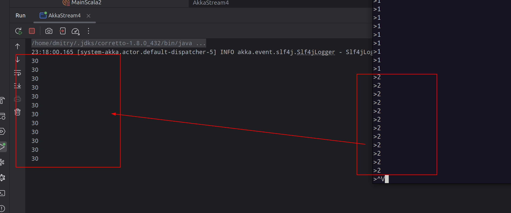

# kafka-homework


Отправляю сообщения в кафку консольным продюсером

```sh
docker exec -it 804c10535da7 /usr/bin/kafka-console-producer --bootstrap-server localhost:29093 --topic test  
```

Принимаю в source вот таким консюмером

```scala

  val consumer = Consumer
    .plainSource(consumerSettings, Subscriptions.topics("test"))
    .map { msg: ConsumerRecord[String, String] => Integer.parseInt(msg.value()) }

```

дальше поток разделяем на 3

```scala

    val multTwo = builder.add(Flow[Int].map(x => x * 2))
    val multTen = builder.add(Flow[Int].map(x => x * 10))
    val multThree = builder.add(Flow[Int].map(x => x * 3))

```

и собираем общую сумму из 3х потоков в

```scala

val zip = builder.add(ZipWith.apply((A1: Int, A2: Int, A3: Int) => {
  A1 + A2 + A3
}))

```

в результате 2 преобразуется в 30

