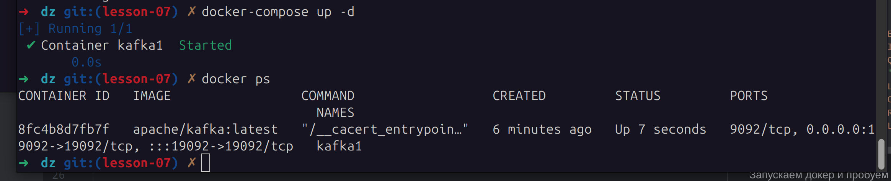
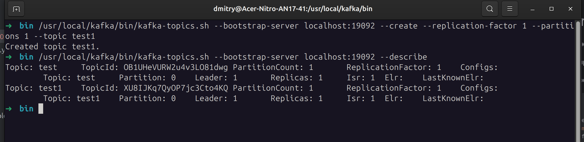
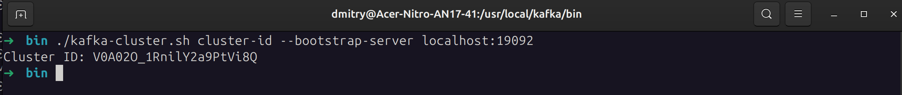
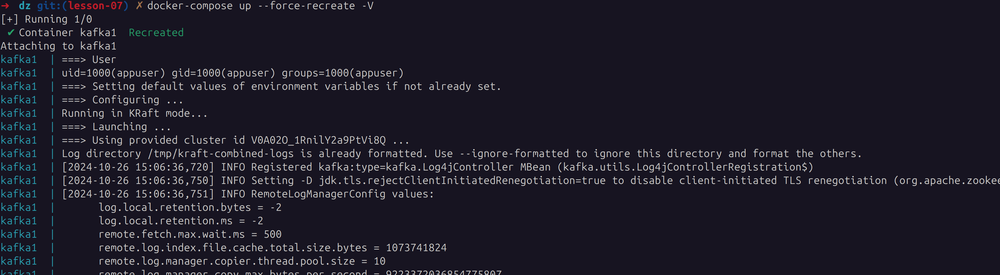
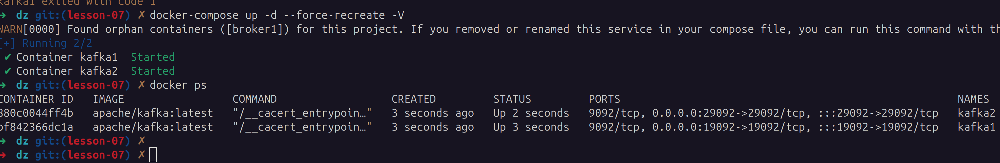
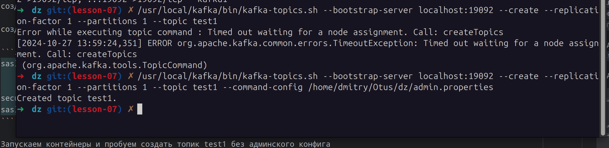

# kafka-homework

Домашнее задание к уроку 7

Создаем 1 экземпляр кафки c kraft в ролях брокер/контроллер, порт 19092

пример docker-compose
```yml
services:
  kafka1:
    image: apache/kafka:latest
    container_name: kafka1
    hostname: kafka1
    ports:
      - "19092:19092"
    environment:
      KAFKA_NODE_ID: 1
      KAFKA_PROCESS_ROLES: 'broker,controller'
      KAFKA_OFFSETS_TOPIC_REPLICATION_FACTOR: 1
      KAFKA_CONTROLLER_QUORUM_VOTERS: '1@kafka1:9093'
      KAFKA_LISTENERS: 'PLAINTEXT://kafka1:9092,CONTROLLER://kafka1:9093,PLAINTEXT_HOST://0.0.0.0:19092'
      KAFKA_ADVERTISED_LISTENERS: 'PLAINTEXT://kafka1:9092,PLAINTEXT_HOST://localhost:19092'
      KAFKA_LISTENER_SECURITY_PROTOCOL_MAP: 'CONTROLLER:PLAINTEXT,PLAINTEXT:PLAINTEXT,PLAINTEXT_HOST:PLAINTEXT'
      KAFKA_INTER_BROKER_LISTENER_NAME: 'PLAINTEXT'
      KAFKA_CONTROLLER_LISTENER_NAMES: 'CONTROLLER'
```

Запускаем докер



Пробуем создать и прочитать топик test1

`/usr/local/kafka/bin/kafka-topics.sh --bootstrap-server localhost:19092 --create --replication-factor 1 --partitions 1 --topic test1`

`/usr/local/kafka/bin/kafka-topics.sh --bootstrap-server localhost:19092 --describe`



Генерируем uuid кластера

`./kafka-storage.sh random-uuid`

копируем результат и добавлям в параметры строку `CLUSTER_ID: 'V0A02O_1RnilY2a9PtVi8Q'`

пересобираем контейнер и проверяем id кластера

`./kafka-cluster.sh cluster-id --bootstrap-server localhost:19092`




Подключаем внешние папки для логов в контейнер kafka1

```yml
    volumes:
      - ./kafka1-logs:/opt/kafka/logs
      - ./kafka1-kraft-combined-logs:/tmp/kraft-combined-logs
```

Папку `kafka1-kraft-combined-logs' форматируем с указанием CLUSTER_ID (конфиг берем локальный, меняем путь к папке логов на локальный)

`./kafka-storage.sh format --ignore-formatted -t V0A02O_1RnilY2a9PtVi8Q -c /usr/local/kafka/config/kraft/server.properties`


В docker-compose добавляем ID нужного кластера `CLUSTER_ID: 'V0A02O_1RnilY2a9PtVi8Q'`

Пересобираем контейнер и запускаем - авто форматирование папки логов не запускается



Добавим контейнер с ролью брокер на порт 29092

```yml
  kafka2:
    image: apache/kafka:latest
    container_name: kafka2
    ports:
      - "29092:29092"
    environment:
      KAFKA_NODE_ID: 2
      KAFKA_PROCESS_ROLES: 'broker'
      KAFKA_LISTENERS: 'PLAINTEXT://:9092,PLAINTEXT_HOST://:29092'
      KAFKA_ADVERTISED_LISTENERS: 'PLAINTEXT://broker1:9092,PLAINTEXT_HOST://localhost:29092'
      KAFKA_INTER_BROKER_LISTENER_NAME: 'PLAINTEXT'
      KAFKA_CONTROLLER_LISTENER_NAMES: 'CONTROLLER'
      KAFKA_LISTENER_SECURITY_PROTOCOL_MAP: 'CONTROLLER:PLAINTEXT,PLAINTEXT:PLAINTEXT,PLAINTEXT_HOST:PLAINTEXT'
      KAFKA_CONTROLLER_QUORUM_VOTERS: '1@kafka1:9093'
      KAFKA_GROUP_INITIAL_REBALANCE_DELAY_MS: 0
      CLUSTER_ID: 'V0A02O_1RnilY2a9PtVi8Q'
    depends_on:
      - kafka1
    volumes:
      - ./kafka2-logs:/opt/kafka/logs
 
 ```



Добавляем в контейнера настройки авторизации

```yml
      KAFKA_AUTHORIZER_CLASS_NAME: org.apache.kafka.metadata.authorizer.StandardAuthorizer
      KAFKA_SUPER_USERS: "User:admin"
      KAFKA_ALLOW_EVERYONE_IF_NO_ACL_FOUND: "true"
      KAFKA_OPTS: "-Djava.security.auth.login.config=/etc/kafka/kafka_server_jaas.conf"
      KAFKA_SASL_ENABLED_MECHANISMS: 'PLAIN'
      KAFKA_SASL_MECHANISM_INTER_BROKER_PROTOCOL: 'PLAIN'
```

правим параметр  
`KAFKA_LISTENER_SECURITY_PROTOCOL_MAP: 'CONTROLLER:PLAINTEXT,PLAINTEXT:PLAINTEXT,PLAINTEXT_HOST:PLAINTEXT'`
на
`KAFKA_LISTENER_SECURITY_PROTOCOL_MAP: 'CONTROLLER:PLAINTEXT,PLAINTEXT:PLAINTEXT,PLAINTEXT_HOST:SASL_PLAINTEXT'`

создаем файл с пользователями  `kafka_server_jaas.conf`

создаем админский конфиг `admin.properties`

```shell
sasl.jaas.config=org.apache.kafka.common.security.plain.PlainLoginModule required \
	username="admin" \
	password="admin";
security.protocol=SASL_PLAINTEXT
sasl.mechanism=PLAIN
```

Запускаем контейнеры и пробуем создать топик test1 без админского конфига

запрос `/usr/local/kafka/bin/kafka-topics.sh --bootstrap-server localhost:19092 --create --replication-factor 1 --partitions 1 --topic test1`

прекращается по таймауту в логах ошибка

`[2024-10-27 10:58:58,020] INFO [SocketServer listenerType=BROKER, nodeId=1] Failed authentication with /172.26.0.1 (channelId=172.26.0.2:19092-172.26.0.1:56244-10) (Unexpected Kafka request of type METADATA during SASL handshake.) (org.apache.kafka.common.network.Selector)
`

добавляем конфиг `--command-config /home/dmitry/Otus/dz/admin.properties` и запускаем снова

топик создался, ошибок нет
