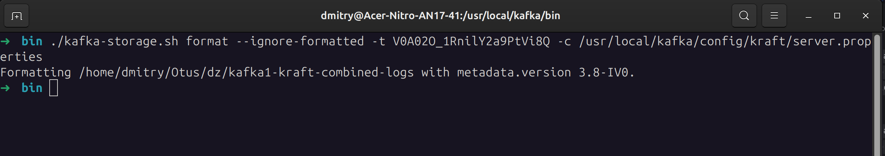

# kafka-homework

Домашнее задание к уроку 7

Создаем 1 экземпляр кафки c kraft в ролях брокер/контроллер, порт 19092

пример docker-compose
```yml
services:
  kafka1:
    image: apache/kafka:latest
    container_name: kafka1
    hostname: kafka1
    ports:
      - "19092:19092"
    environment:
      KAFKA_NODE_ID: 1
      KAFKA_PROCESS_ROLES: 'broker,controller'
      KAFKA_OFFSETS_TOPIC_REPLICATION_FACTOR: 1
      KAFKA_CONTROLLER_QUORUM_VOTERS: '1@kafka1:9093'
      KAFKA_LISTENERS: 'PLAINTEXT://kafka1:9092,CONTROLLER://kafka1:9093,PLAINTEXT_HOST://0.0.0.0:19092'
      KAFKA_ADVERTISED_LISTENERS: 'PLAINTEXT://kafka1:9092,PLAINTEXT_HOST://localhost:19092'
      KAFKA_LISTENER_SECURITY_PROTOCOL_MAP: 'CONTROLLER:PLAINTEXT,PLAINTEXT:PLAINTEXT,PLAINTEXT_HOST:PLAINTEXT'
      KAFKA_INTER_BROKER_LISTENER_NAME: 'PLAINTEXT'
      KAFKA_CONTROLLER_LISTENER_NAMES: 'CONTROLLER'
```

Запускаем докер


Пробуем создать и прочитать топик test1

`/usr/local/kafka/bin/kafka-topics.sh --bootstrap-server localhost:19092 --create --replication-factor 1 --partitions 1 --topic test1`

`/usr/local/kafka/bin/kafka-topics.sh --bootstrap-server localhost:19092 --describe`


Генерируем uuid кластера

`./kafka-storage.sh random-uuid`

копируем результат и добавлям в параметры строку `CLUSTER_ID: 'V0A02O_1RnilY2a9PtVi8Q'`

пересобираем контейнер и проверяем id кластера

`./kafka-cluster.sh cluster-id --bootstrap-server localhost:19092`


Подключаем внешние папки для логов 

```yml
    volumes:
      - ./kafka1-logs:/opt/kafka/logs
      - ./kafka1-kraft-combined-logs:/tmp/kraft-combined-logs
```

Папку `kafka1-kraft-combined-logs' форматируем с указанием CLUSTER_ID (конфиг берем локальный, меняем путь к папке логов на локальный)

`./kafka-storage.sh format --ignore-formatted -t V0A02O_1RnilY2a9PtVi8Q -c /usr/local/kafka/config/kraft/server.properties`



В docker-compose добавляем ID нужного кластера `CLUSTER_ID: 'V0A02O_1RnilY2a9PtVi8Q'`

Пересобираем контейнер и запускаем - авто форматирование папки логов не запускается

