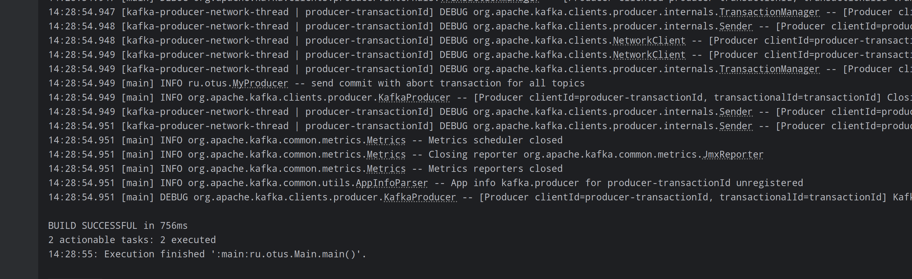
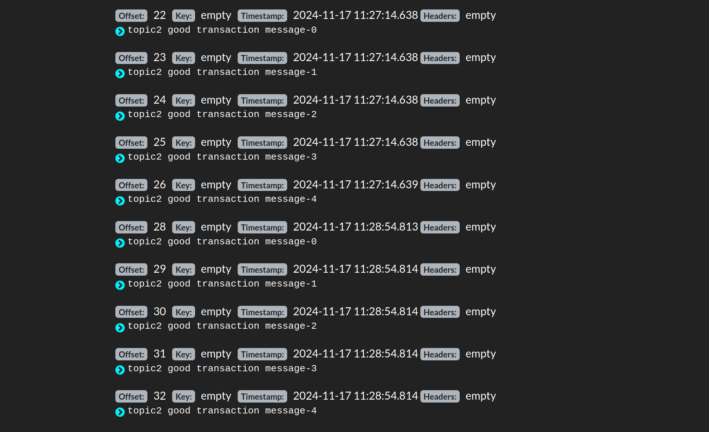

# kafka-homework

## Текст задания
Описание/Пошаговая инструкция выполнения домашнего задания:

    Запустить Kafka
    Создать два топика: topic1 и topic2
    Разработать приложение, которое:
        открывает транзакцию
        отправляет по 5 сообщений в каждый топик
        подтверждает транзакцию
        открывает другую транзакцию
        отправляет по 2 сообщения в каждый топик
        отменяет транзакцию
    Разработать приложение, которое будет читать сообщения из топиков topic1 и topic2 так, чтобы сообщения из подтверждённой транзакции были выведены, а из неподтверждённой - нет.


## Домашнее задание к уроку 11

Запускаем 1 экземпляр kafka на порту 29092 и для контроля kafdrop


Создаем 2 топика

```shell
docker exec -it 4da7d3832d08 /usr/bin/kafka-topics --bootstrap-server localhost:29092 --create --replication-factor 1 --partitions 1 --topic topic1

docker exec -it 4da7d3832d08 /usr/bin/kafka-topics --bootstrap-server localhost:29092 --create --replication-factor 1 --partitions 1 --topic topic2
```

Проверяем создание в kafdrop


Создаем продюсер в отдельном классе MyProducer, в настройках для транзакций добавляем `TRANSACTIONAL_ID_CONFIG`

```java
        Map<String, Object> producerConfig = Map.of(
                ProducerConfig.BOOTSTRAP_SERVERS_CONFIG, "localhost:29092",
                ProducerConfig.ACKS_CONFIG, "all",
                ProducerConfig.KEY_SERIALIZER_CLASS_CONFIG, StringSerializer.class,
                ProducerConfig.VALUE_SERIALIZER_CLASS_CONFIG, StringSerializer.class,
                ProducerConfig.TRANSACTIONAL_ID_CONFIG, "transactionId"
        );
```

Коммитим и отменяем транзакции методами - `commitTransaction` и `abortTransaction`

Запускаем продюсер



Проверяем наличие сообщений в топиказ через kafdrop
