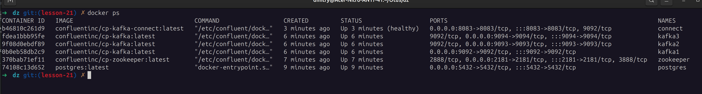

# kafka-homework

Запускаем zookeper, kafka, kafka-connect и postgres 

проверяем состояние

проверяем плагины коннекторов запросом на `http://localhost:8083/connector-plugins`

проверяем топики connect

создаем таблицу и заполняем данными, проверяем

создаем debezium коннектор

`curl -X POST --data-binary "@customers-cdc.json" -H "Content-Type: application/json" http://localhost:8083/connectors | jq`

и проверяем его статус

`curl http://localhost:8083/connectors/customers-cdc-connector/status | jq`

запускаем слушателя kafka и добавляем записи с таблицу

`docker exec kafka1 kafka-console-consumer --topic postgres.cdc.public.customers --bootstrap-server kafka1:19092,kafka2:19093,kafka3:19094 --from-beginning --property print.offset=true`

