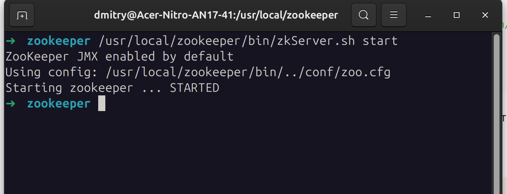
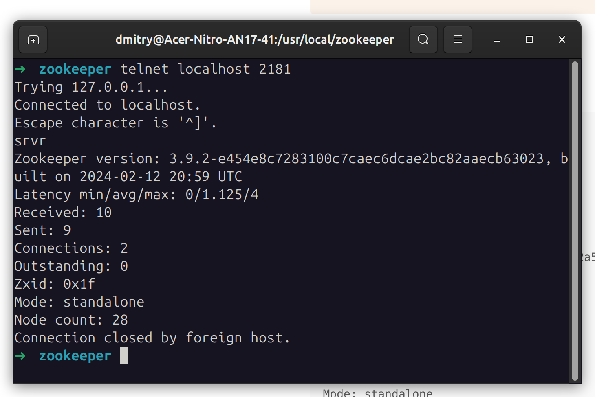
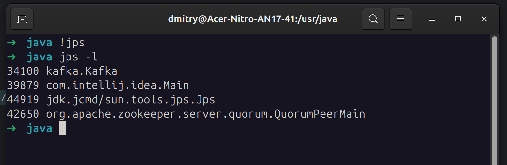
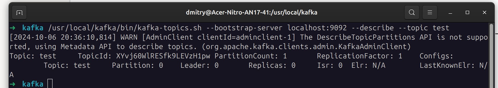
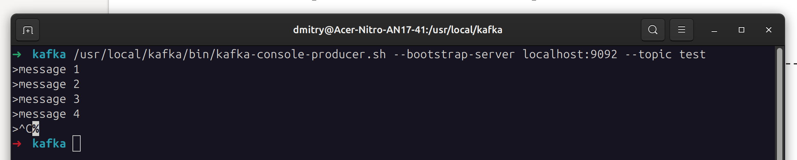
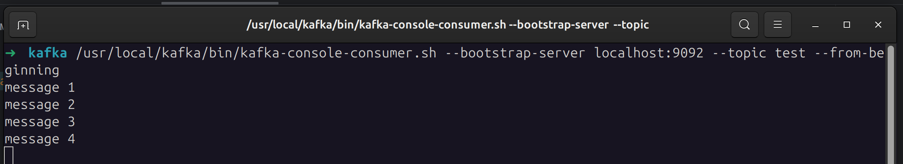

# Домашнее задание к уроку 2


## Устанавливаем jdk, zookeeper и kafka

Устанавливаем локально пакет java https://download.oracle.com/java/17/latest/jdk-17_linux-x64_bin.deb


Заполняем переменную JAVA_HOME и проверяем

```shell
export JAVA_HOME=/usr/java/jdk-17-oracle-x64
echo $JAVA_HOME
```

### Устанавливаем zookeeper

Качаем и разархивируем zookeeper

```shell
wget https://dlcdn.apache.org/zookeeper/zookeeper-3.9.2/apache-zookeeper-3.9.2-bin.tar.gz
tar -zxf apache-zookeeper-3.9.2-bin.tar.gz
```

Переносим в local
```shell
mv zookeeper-3.4.6 /usr/local/zookeeper
```

Создаем папку под данные
```shell
mkdir -p /var/lib/zookeeper
```

Создаем конфиг

```shell
cat > /usr/local/zookeeper/conf/zoo.cfg << EOF
> tickTime=2000
> dataDir=/tmp/zookeeper
> clientPort=2181
> EOF
```

запускаем zookeper

```shell
/usr/local/zookeeper/bin/zkServer.sh start
```

Результат - STARTED



Проверяем доступность порта и состояние zookeeper, подключаемся через telnet и отправляем команду srvr




### Устанавливаем Kafka


Качаем и разархивируем kafka

```shell
wget https://downloads.apache.org/kafka/3.8.0/kafka_2.12-3.8.0.tgz
tar -zxf kafka_2.13-3.8.0.tgz
```

Переносим в local

```shell
mv kafka_2.13-3.8.0 /usr/local/kafka
```

Создаем папку под логи

```shell
mkdir /tmp/kafka-logs
```

Запускаем kafka

```shell
/usr/local/kafka/bin/kafka-server-start.sh -daemon /usr/local/kafka/config/server.properties
```

Проверям наличие процесса




### Работа с топиками

Создаем топик test

```shell
usr/local/kafka/bin/kafka-topics.sh --bootstrap-server localhost:9092 --create --replication-factor 1 --partitions 1 --topic test
```

Проверяем наличие топика

```shell
/usr/local/kafka/bin/kafka-topics.sh --bootstrap-server localhost:9092 --describe --topic test
```



Создаем 4 сообщения

```shell
/usr/local/kafka/bin/kafka-console-producer.sh --bootstrap-server localhost:9092 --topic test
```



Получаем сообщения из топика test в порядке "с начала"

```shell
/usr/local/kafka/bin/kafka-console-consumer.sh --bootstrap-server localhost:9092 --topic test --from-beginning
```

